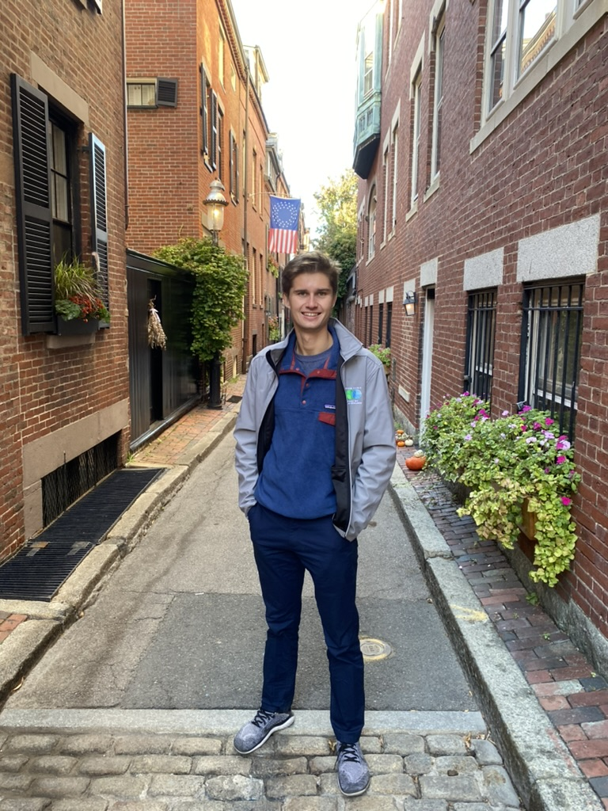

# Welcome

$~$

**Please click on the below links to view my qualifications and past projects! **

*About Me -*

I am a first year master's student in Biostatistics at Columbia University. I am experienced in research with a demonstrated history of working in public health data science and medicine. Skilled in R, Python, big data analysis, and SQL. Recent graduate as a Statistics/Data Science and Biology double major from UC Santa Barbara.

[Resume](about.html)

[Github](https://github.com/arthur-starodynov/Compiled_Projects)

[Linkedin](https://www.linkedin.com/in/arthur-starodynov/)

$~$

# This is me! 

{width=400px}

